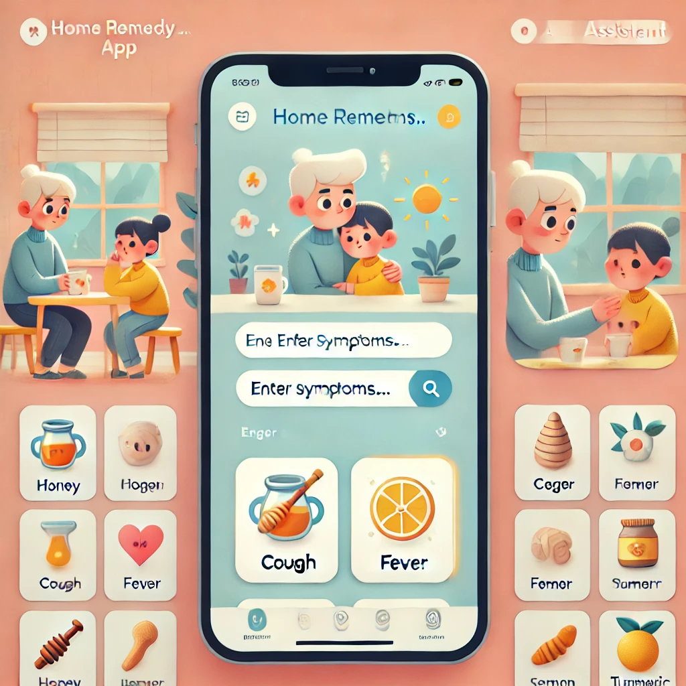

# 🌿 HomeCure-Kids-App 🏡👶




## 📝 Description
The **HomeCure-Kids-App** is designed to help parents and caregivers find **home remedies** for common kids' illnesses using readily available **kitchen ingredients**. The app takes user inputs such as **symptoms** and **available ingredients**, then suggests soothing and easy-to-prepare **remedies** or **recipes**.

---

## ✨ Features
✅ **Symptom-Based Search**: Enter symptoms (e.g., sore throat, cough, upset stomach) to receive remedy suggestions.  
✅ **Ingredient Matching**: Find remedies based on ingredients available at home.  
✅ **Interactive Guidance**: Step-by-step preparation instructions for each remedy.  
✅ **Ingredients_to_buy**: If no ingredients matches or no available ingredients , the app suggest parent a list of items to buy.


---

## 🛠️ Technology Stack
📌 **Back-End**: FastAPI  
📌 **Database**: PostgreSQL  
📌 **AI Integration**:
- 🤖 **Transformer-based models**: **GPT-4o-mini**, **Gemini 1.5-Flash**, **Groq LLaMA 3.3 70B Versatile** for remedy generation.


---

## 🚀 Getting Started

### 📌 Prerequisites
Ensure you have the following installed:
- 🐍 **Python** (for FastAPI backend)
- 🛢 **PostgreSQL** (for database setup)

### 🔧 Installation
#### 1️⃣ Clone the repository:
```sh
git clone https://github.com/Preethicoder/HomeCure-Kids-App.git
cd HomeCure-Kids-App
```

#### 2️⃣ Set up the backend:
```sh
cd backend
python -m venv venv
source venv/bin/activate  # On Windows, use venv\Scripts\activate
pip install -r requirements.txt
uvicorn main:app --reload
```

---

## 📌 Usage
1️⃣ **Enter symptoms** and **available ingredients**.  
2️⃣ **Get recommended home remedies**.  
3️⃣ **Follow the step-by-step instructions** to prepare the remedy.  


---

## 💡 Contribution
We welcome contributions! If you'd like to improve the app, feel free to:
- 🔹 Submit a **pull request**
- 🔹 Report **issues** or suggest **features**

---

## 📬 Contact
For any inquiries, reach out at 📧 **[preethisivakumar2024@gmail.com](mailto:preethisivakumar2024@gmail.com)**.

---

**Made with ❤️ for parents and caregivers!** 🌸👨‍👩‍👧‍👦
